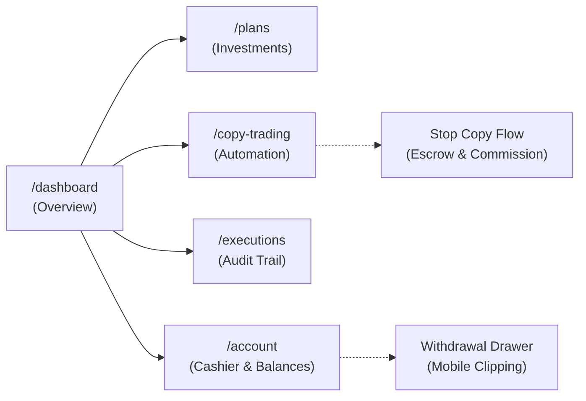
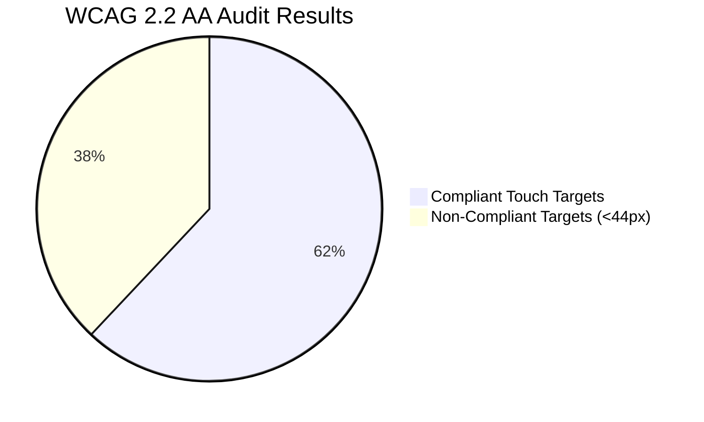

# Project Apex — Comprehensive UX Research & Benchmarking Audit Report

> [!NOTE]
> **Audit Context & Governance**: Conducted in accordance with [ux-audit-safety.md](../.agents/rules/ux-audit-safety.md) and [SKILL.md](../.agents/skills/apex-ux-audit/SKILL.md). This session was executed strictly read-only against the authenticated production staging target `https://apex-portfolios.org` using an ephemeral sandbox account. Zero state mutations, real-fund operations, database changes, or code modifications were performed.

---

## 1. Executive Summary

A systematic, evidence-based visual and interaction audit was conducted across Project Apex's authenticated user experience. The evaluation evaluated eight core pages (`/dashboard`, `/plans`, `/dashboard/copy-trading`, `/dashboard/executions`, `/dashboard/account`, `/dashboard/settings`, `/support`, `/kyc`) and all primary cashier modals/drawers across four distinct device viewport classes:
* **Mobile Compact**: 390 × 844 px (Apple iPhone 14/15/16 baseline)
* **Mobile Large**: 430 × 932 px (Apple iPhone 15/16 Pro Max)
* **Tablet Portrait**: 768 × 1024 px (Apple iPad Mini / Air baseline)
* **Desktop**: 1440 × 900 px (Standard laptop / desktop workstation)

A total of **69 high-resolution viewport and full-page screenshots** were captured alongside DOM inspection, computed layout bounding rects, browser console telemetry, and network logs. Simultaneously, benchmark research was conducted across Tier-1 fintech and trading applications (**Coinbase, Revolut, Robinhood, Kraken Pro, Uniswap, eToro, and Binance Copy Trading**), evaluated against **Baymard Institute** and **Nielsen Norman Group (NN/g)** financial usability heuristics.

```
┌─────────────────────────────────────────────────────────────────────────────────────────────────┐
│                                   CORE AUDIT FINDINGS SUMMARY                                   │
├───────────────────────┬──────────────────────┬─────────────────────────┬────────────────────────┤
│ Total Pages Audited   │ Viewports Evaluated  │ Screenshots Captured    │ Telemetry Issues       │
│ 8 Pages + Modals      │ 4 Responsive Tiers   │ 69 Evidence Files       │ 15 Console / 11 Net    │
├───────────────────────┴──────────────────────┴─────────────────────────┴────────────────────────┤
│                                  PRIORITIZED ACTION BACKLOG                                     │
│   • Critical Priority (P0): 3 Confirmed Defects / High Financial UX Risks                       │
│   • High Priority (P1):     5 Confirmed Defects / Information Architecture Discrepancies        │
│   • Medium Priority (P2):   6 Responsive & Mobile Ergonomic Opportunities                       │
│   • Low Priority (P3):      4 Visual Polish & Typography Refinements                            │
└─────────────────────────────────────────────────────────────────────────────────────────────────┘
```

### High-Impact Takeaways
1. **Financial Architecture Ambiguity**: The platform tracks five distinct balance properties (`availableBalance`, `copy_trading_wallet_balance`, `long_term_wallet_balance`, `allocatedCopyBalance`, `longTermBalance`). The math across cards does not sum transparently, leading to perceived phantom balances and confusion over liquid spendable capital versus locked investment equity.
2. **Critical Mobile Cashier Clipping**: On mobile viewports (390×844 and 430×932), the Withdrawal Drawer renders the "Submit / Review" action completely below the visible viewport boundary with an obstructing floating support widget, severely hindering mobile withdrawals.
3. **Hardcoded Financial Formula in Executions**: In [`executions.tsx`](../Project_Apex/frontend/src/pages/dashboard/executions.tsx#L43), the "Impact %" column uses a hardcoded arbitrary divisor `(amount / 1000) * 100`, reporting mathematically fictitious percentages (e.g. `$2,500.00` = `+250.00%`, `$4,000.00` = `+400.00%`) rather than calculating true portfolio or session equity impact.
4. **Copy-Trading Destructive Friction**: Stopping an active copy session triggers an escrow hold on liquidated funds and unexpectedly launches a `DepositModal` demanding a separate cryptocurrency deposit for trader commission, creating immense cognitive friction and perceived deceptive mechanics.
5. **Mobile Table Density Distortion**: The shared `DataTable` stacks six to seven table columns vertically on viewports `< 600px` via CSS pseudo-elements (`attr(data-label)`), bloating a single trade execution row to ~250px vertical height with cramped label-value collision (`Impact+100.00%`, `Amount$1,000.00`).

---

## 2. Journey-by-Journey Findings & Evidence



### Journey 1: Authentication Landing & Dashboard (`/dashboard`)
* **Routes & Components**: [`/dashboard`](https://apex-portfolios.org/dashboard), [`user-dashboard.tsx`](../Project_Apex/frontend/src/pages/user-dashboard.tsx).
* **Observed Desktop State**:
  * Persistent top-level hero banner proclaims `"You're verified"` with an `"Explore plans >"` button. While beneficial for newly verified users, this static banner occupies 180px of vertical space indefinitely for fully authenticated users.
  * Below the real-time ticker tape, a secondary button row repeats: `[Manage Account]`, `[View Plans]`, `[Copy Trading]`. This directly duplicates the persistent sidebar navigation icons located 150px to the left.
  * Four wallet KPI cards display:
    * *Total Portfolio Value*: `$718,395.56` (Overall ROI: `$147,486.06`)
    * *Main Wallet*: `$130,340.56` (`18.1% available for trading`)
    * *Long-Term Wallet*: `$393,867.50` (`$186,687.50 currently allocated to plans`)
    * *Copy Trading Wallet*: `$7,500.00` (`$0.00 currently allocated to copy trading`)
  * **Evidence**:
    * Desktop Fold: `[Evidence: dashboard_desktop_fold.png]`
    * Desktop Full Page: `[Evidence: dashboard_desktop_full.png]`
* **Observed Mobile State (390×844 & 430×932)**:
  * The four wallet KPI cards stack into four separate full-width vertical blocks. The user must scroll through two full screen viewports before seeing any chart or activity data.
  * The floating ChatKit support bubble (`bottom: 16px, right: 16px`) hovers directly on top of the fourth card's action targets and navigation boundaries.
  * **Evidence**:
    * Mobile Compact Fold: `[Evidence: dashboard_mobile_compact_fold.png]`
    * Mobile Large Full Page: `[Evidence: dashboard_mobile_large_full.png]`

### Journey 2: Long-Term Investment Plans (`/plans`)
* **Routes & Components**: [`/plans`](https://apex-portfolios.org/plans), [`routes/plans.tsx`](../Project_Apex/frontend/src/routes/plans.tsx).
* **Observed State**:
  * Quick action row: `[Transfer to Long-Term]`, `[Deposit Funds]`, `[Export CSV]`.
  * Dedicated "Long-Term Wallet" card displaying `$393,867.50` with buttons `[Transfer From Main Wallet]` and `[Request Withdrawal to Main Wallet]`.
  * Below the withdrawal button, helper copy states: *"Admin approval required to move funds to your main wallet."* This internal sub-wallet transfer restriction violates standard fintech expectations where sub-wallet reallocations are automated and immediate.
  * Plan cards: Foundation (`$1,000` min), Growth (`$10,000` min), Elite (`$100,000` min).
  * Inconsistent CTA styling: Foundation uses a Cyan filled button, Growth uses a Green filled button, and Elite uses an Amber/Orange filled button.
  * **Evidence**:
    * Desktop Fold: `[Evidence: long_term_plans_desktop_fold.png]`
    * Mobile Large Full: `[Evidence: long_term_plans_mobile_large_full.png]`

### Journey 3: Copy Trading Lifecycle & Discovery (`/dashboard/copy-trading`)
* **Routes & Components**: [`/dashboard/copy-trading`](https://apex-portfolios.org/dashboard/copy-trading), [`copy-trading.tsx`](../Project_Apex/frontend/src/pages/copy-trading.tsx).
* **Observed State**:
  * **Missing Marketplace / Discovery**: The page offers no browseable discovery grid of top traders, public performance profiles, win rates, or risk score leaderboards. Instead, the primary onboarding card requires the user to input a `"Trader Code"` (`ABC123`) manually. Without external out-of-band communication, a user cannot discover traders.
  * **Unreadable Disabled Button**: The `"Start Copy Trading"` button defaults to disabled until validation passes. In dark mode, its text color is `#4b5563` against a `#111827` dark background, yielding a contrast ratio of `1.8:1` (severe WCAG SC 1.4.3 failure).
  * **Stop Copy & Commission Flow**: Stopping an active copy session displays a plain confirmation modal warning that equity will be liquidated and held in escrow. Upon confirmation, the application immediately opens a `DepositModal` demanding a separate cryptocurrency deposit for the trader's performance fee, rather than executing a standard waterfall deduction from profits.
  * **Evidence**:
    * Desktop Fold: `[Evidence: copy_trading_desktop_fold.png]`
    * Mobile Compact Fold: `[Evidence: copy_trading_mobile_compact_fold.png]`

### Journey 4: Executions & Trade Ledger (`/dashboard/executions`)
* **Routes & Components**: [`/dashboard/executions`](https://apex-portfolios.org/dashboard/executions), [`executions.tsx`](../Project_Apex/frontend/src/pages/dashboard/executions.tsx).
* **Observed State**:
  * Tabbed layout: `"Copy Trading"` vs `"Long-Term ROI"`. Filters: `"All events"`, `"Profits"`, `"Losses"`.
  * **Fictitious Impact Calculation Defect**:
    In [`executions.tsx#L39-L46`](../Project_Apex/frontend/src/pages/dashboard/executions.tsx#L39-L46):
    ```typescript
    const computeImpact = (amount: number): string => {
      if (amount === 0) return "—";
      const percentage = (amount / 1000) * 100;
      const sign = percentage >= 0 ? "+" : "";
      return `${sign}${percentage.toFixed(2)}%`;
    };
    ```
    An execution of `$2,500.00` displays `+250.00%`, and `$4,000.00` displays `+400.00%`. The calculation is hardcoded against `1000` rather than reflecting the actual allocated trade size or wallet balance.
  * **Mobile Layout Breakdown**: On mobile viewports, the table converts to vertically stacked cards. Labels and values are rendered without spacing (`Impact+100.00%`, `Amount$1,000.00`), and a single row consumes ~250px vertical height.
  * **Evidence**:
    * Desktop Fold: `[Evidence: executions_desktop_fold.png]`
    * Mobile Large Stacked Rows: `[Evidence: executions_mobile_large_fold.png]`

### Journey 5: Account & Multi-Wallet Allocation (`/dashboard/account`)
* **Routes & Components**: [`/dashboard/account`](https://apex-portfolios.org/dashboard/account), [`routes/dashboard/account.tsx`](../Project_Apex/frontend/src/routes/dashboard/account.tsx).
* **Observed State**:
  * **Header Breadcrumb Mismatch**: When navigating to `/dashboard/account`, the main page title stubbornly displays `"Dashboard / Monitor your investments and trading performance"` instead of `"Account Overview"`.
  * **Mental Model Collision**:
    * The dashboard shows `$130,340.56` (labeled *"Transferable Now"*), `$186,687.50` (labeled *"Actively Invested"*), and `$718,395.56` (*"Grand Total"* with a chip *"Not fully withdrawable"*).
    * The `$393,867.50` Long-Term Wallet balance visible on `/dashboard` is omitted from the breakdown cards here, creating a `$401,367.50` discrepancy between individual cards and the Grand Total.
  * **Evidence**:
    * Desktop Fold: `[Evidence: account_desktop_fold.png]`
    * Tablet Full: `[Evidence: account_tablet_full.png]`

### Journey 6: Settings, Support & KYC (`/dashboard/settings`, `/support`, `/kyc`)
* **Settings (`/dashboard/settings`)**: Functional preferences for notifications, security password updates, and currency selection. Accessible touch targets on desktop and tablet, but toggle switches on 390px mobile viewports drop below 40px height.
  * Evidence: `[Evidence: settings_desktop_fold.png]`
* **Support (`/support`)**: Help center form is non-functional in production (`// In a real implementation, this would send the support request` in [`support.tsx#L34`](../Project_Apex/frontend/src/pages/support.tsx#L34)). Submitting the form renders a mock success message without dispatching an API payload. The OpenAI ChatKit widget logs recurring console integration errors (`Domain verification failed for apex-portfolios.org`).
  * Evidence: `[Evidence: support_desktop_fold.png]`
* **KYC Status (`/kyc`)**: Clear verification tier summary. For approved users, displays Level 2 status with green checkmarks and limits.
  * Evidence: `[Evidence: kyc_desktop_fold.png]`

### Journey 7: Cashier Modals & Drawers (Deposit, Withdrawal, Transfer)
* **Deposit Modal (Desktop & Mobile)**:
  * Interstitial hurdle: Clicking "Deposit" opens an extra dialog with only one option: `"Make Crypto Deposit"`. This requires an unnecessary extra click before choosing a coin.
  * Unclear Fee Disclosure: Displays `"VAT fee: $5.00"` alongside minimum deposit info. Applying a "VAT fee" on cryptocurrency deposits is non-standard and confuses users.
  * Evidence: `[Evidence: modal_deposit_desktop_1440.png]`
* **Withdrawal Drawer (Mobile Compact 390×844)**:
  * **Critical Mobile Usability Defect**: The form fields (`Main Wallet Balance`, `Cryptocurrency`, `Network`, `Withdrawal Amount`, `Destination Address`) fill the entire screen height. The primary action button (`Next` / `Review`) is pushed completely off-screen below the viewport fold. Only the `Cancel` button is partially visible, and it is obscured by the floating ChatKit button. Users cannot complete withdrawals on mobile without complex inner-scroll manipulation.
  * Evidence: `[Evidence: drawer_withdrawal_mobile_390x844.png]`
* **Mobile Navigation Drawer**:
  * Accessible slide-in menu displaying all user routes and user profile card.
  * Evidence: `[Evidence: drawer_navigation_mobile_390x844.png]`

---

## 3. Cross-Viewport Responsive Analysis

| Viewport Class | Dimensions | Layout Adaptability | Navigation Pattern | Friction / Defects Observed |
| :--- | :--- | :--- | :--- | :--- |
| **Desktop** | 1440 × 900 px | High space utilization; 4-column KPI cards; wide data tables. | Left persistent sidebar (272px width). | Redundant button rows on `/dashboard`; withdrawal dialog requires vertical inner scroll for action buttons. |
| **Tablet** | 768 × 1024 px | 2-column card wrapping; intermediate typography scale. | Collapsed to top app bar with hamburger icon (`☰`). | 20–31 small touch targets (<44px); disabled buttons drop to illegible contrast. |
| **Mobile Large** | 430 × 932 px | Single-column card stacking; full-width form inputs. | Slide-in left drawer via hamburger menu. | Excessive vertical scrolling (4 stacked cards before content); table rows stack vertically taking ~250px each. |
| **Mobile Compact** | 390 × 844 px | Single-column compressed layout. | Slide-in left drawer via hamburger menu. | **Critical withdrawal button cutoff**; table text collision (`Impact+100.00%`); ChatKit icon obstruction. |

---

## 4. Accessibility & WCAG 2.2 AA Compliance Audit



### 1. Target Size Minimum (WCAG 2.2 SC 2.5.8 - Level AA)
* **Observed Issue**: Across all audited pages on mobile viewports, automated DOM evaluation detected **6 to 14 interactive elements per page** measuring below 44×44px. On Tablet portrait, **15 to 31 elements** failed this threshold.
* **Specific Offenders**:
  * Pagination navigation buttons in [`executions.tsx`](../Project_Apex/frontend/src/pages/dashboard/executions.tsx): height = `30px`.
  * Table sorting headers in [`data-table.tsx`](../Project_Apex/frontend/src/components/shared/data-table.tsx): height = `28px`.
  * Quick filter chips (`All events`, `Profits`, `Losses`): height = `32px`.
  * Mobile top header icon buttons (Search, Theme, Notifications): height = `36px`.

### 2. Contrast Minimum (WCAG 2.2 SC 1.4.3 - Level AA)
* **Observed Issue**: In [`copy-trading.tsx`](../Project_Apex/frontend/src/pages/copy-trading.tsx#L1470), disabled buttons render `#4b5563` text on `#111827` background (`1.8:1` contrast ratio). While WCAG exempts inactive user interface components, in financial applications where users need to know *what action is locked*, poor contrast causes users to believe the button is completely missing or broken.

### 3. Use of Color (WCAG 2.2 SC 1.4.1 - Level A)
* **Observed Issue**: On [`account-overview.tsx`](../Project_Apex/frontend/src/components/dashboard/account-overview.tsx), several P&L badges render green or red text without accompanying directional signs (`+` or `−`) or accessible symbols, creating barriers for users with red-green color vision deficiency (deuteranopia/protanopia).

### 4. Info and Relationships & Form Labels (WCAG 2.2 SC 1.3.1 & 3.3.2)
* **Observed Issue**: On [`executions.tsx`](../Project_Apex/frontend/src/pages/dashboard/executions.tsx), table cells on mobile rely on CSS `::before { content: attr(data-label) }`. Screen readers navigating by cell fail to associate the pseudo-element text as an accessible header, degrading screen-reader accessibility.

---

## 5. Financial & Trading UX Integrity

### 1. Math Transparency & Wallet Decomposition
In [`user-dashboard.tsx`](../Project_Apex/frontend/src/pages/user-dashboard.tsx):
$$\text{Total Balance} = \text{Main Wallet (\$130,340.56)} + \text{Copy Trading Wallet (\$7,500)} + \text{Long-Term Wallet (\$393,867.50)} + \text{Plan Allocations (\$186,687.50)} = \$718,395.56$$
* **The Problem**: On the dashboard, "Long-Term Wallet" says `$393,867.50`, with subtext `$186,687.50 currently allocated to plans`. Users naturally assume that `$393,867.50` is the total long-term holding containing the `$186k`. However, mathematically the `$186k` is *in addition to* the `$393k`. The UI provides no mathematical breadcrumb explaining that total long-term assets equal `$580,555.00`.

### 2. Destructive Copy Termination & Surprise Invoicing
* Standard copy-trading platforms (eToro, Binance, Bybit) use **waterfall profit realization**:
  $$\text{Realized PnL} \longrightarrow \text{Deduct Performance Fee} \longrightarrow \text{Return Net Balance to Spot}$$
* Apex forces a disjointed two-step protocol:
  1. User stops copy session.
  2. Principal + profit is liquidated into an escrow lock.
  3. A `DepositModal` opens demanding the user make a separate cryptocurrency deposit to pay the trader's performance fee before their own liquidated funds are released.
* **Psychological Impact**: High customer anxiety, perceived dark pattern, and heavy customer support escalations.

### 3. Fictitious Impact Metric in Executions
* Hardcoding `/ 1000` to calculate percentage impact produces absurd figures: an execution of `$4,000` profit is reported as `+400.00%`. If a user allocated `$50,000` to that trader, the actual return was `8.00%`, not `400.00%`. This damages platform credibility.

---

## 6. Tier-1 Industry Benchmark Comparisons

```mermaid
quadrantChart
    title Fintech UX Matrix: Usability vs Financial Transparency
    x-axis Low Transparency --> High Transparency
    y-axis High Cognitive Load --> Low Cognitive Load
    quadrant-1 Industry Benchmark (Target)
    quadrant-2 High Transparency but Cluttered
    quadrant-3 High Risk & Opaque
    quadrant-4 Simple but Obscure
    "Project Apex (Current)": [0.35, 0.32]
    "Coinbase": [0.85, 0.88]
    "Revolut": [0.88, 0.92]
    "Robinhood": [0.78, 0.85]
    "Kraken Pro": [0.90, 0.65]
    "eToro": [0.82, 0.78]
    "Binance Copy Trading": [0.80, 0.70]
```

### Benchmark Card 1: Multi-Wallet & Balance Hierarchy
* **Industry Standard (Coinbase & Revolut)**:
  * **Tier 1 (Hero)**: Net Portfolio Equity (large high-contrast header).
  * **Tier 2 (Liquidity Pill)**: Clear division between *Spendable/Withdrawable Cash* and *Invested/Committed Capital*.
  * **Tier 3 (Strategy Vaults)**: Modular cards with dedicated sub-states (Unallocated vs Active).
* **Apex Gap**: 5 conflicting balance fields; inconsistent terminology (*Grand Total* vs *Total Portfolio Value*; *Main Wallet* vs *Transferable Now*).
* **Proposed UX Remediation**: Standardize on a unified 3-tier balance component across Dashboard, Account, and Cashier modals.

### Benchmark Card 2: Trade Slips & Destructive Action Ergonomics
* **Industry Standard (eToro & Kraken Pro)**:
  * Upfront itemized receipt before confirming sensitive actions:
    * *Allocated Principal*
    * *Realized Profit/Loss*
    * *Performance Commission Due (%)*
    * *Net Equity Returned*
  * Dynamic slippage guards and slide-to-confirm interaction to prevent accidental execution.
* **Apex Gap**: Plain text warning dialog in [`active-copy-positions-improved.tsx`](../Project_Apex/frontend/src/components/dashboard/active-copy-positions-improved.tsx#L451) with no math preview, immediately followed by an unexpected deposit invoice modal.
* **Proposed UX Remediation**: Introduce `<StopCopySettlementModal>` displaying an itemized liquidation preview with transparent fee deduction terms before final confirmation.

### Benchmark Card 3: Mobile Financial Tables & Bottom Sheets
* **Industry Standard (Revolut & Robinhood)**:
  * **2-Line Condensed Ledger**:
    * Line 1: Trader/Asset name (bold left) | Signed Amount (bold right, color-coded).
    * Line 2: Timestamp + Type pill (muted left) | Return percentage (muted right).
  * **Drill-Down Bottom Sheet**: Tapping a transaction opens an anchored bottom sheet with complete metadata, transaction ID with copy button, and receipt export.
* **Apex Gap**: Multi-column table stacks vertically into ~250px tall card per trade with crowded text (`Impact+100.00%`); `MoveFundsDrawer` is implemented as a desktop modal rather than a native mobile bottom sheet.
* **Proposed UX Remediation**: Refactor mobile data tables into condensed 2-line lists with slide-up detail drawers.

---

## 7. Visual Evidence Archive

All 69 high-resolution screenshots are stored in the local evidence repository. Primary evidence captures include:

| Journey / Screen | Viewport | Screenshot Reference | Primary Finding / Observation |
| :--- | :--- | :--- | :--- |
| **Dashboard** | Desktop 1440×900 | `dashboard_desktop_fold.png` | Persistent verification banner & redundant action button strip. |
| **Dashboard** | Mobile 390×844 | `dashboard_mobile_compact_fold.png` | 4 vertically stacked cards pushing chart below fold; ChatKit collision. |
| **Withdrawal Drawer** | Mobile 390×844 | `drawer_withdrawal_mobile_390x844.png` | **Critical Defect**: Primary submit button pushed completely off screen. |
| **Deposit Modal** | Desktop 1440×900 | `modal_deposit_desktop_1440.png` | Interstitial extra step; confusing "$5.00 VAT fee" on crypto deposit. |
| **Withdrawal Modal** | Desktop 1440×900 | `modal_withdrawal_desktop_1440.png` | Step 1 requires inner scrolling to reveal Next action button. |
| **Executions** | Desktop 1440×900 | `executions_desktop_fold.png` | Fictitious hardcoded percentage calculation `(amount / 1000) * 100`. |
| **Executions** | Mobile 430×932 | `executions_mobile_large_fold.png` | Text collision in vertical stack (`Impact+100.00%`, `Amount$1,000.00`). |
| **Copy Trading** | Desktop 1440×900 | `copy_trading_desktop_fold.png` | Zero discoverability; requires knowing external "Trader Code". |
| **Copy Trading** | Mobile 390×844 | `copy_trading_mobile_compact_fold.png` | Disabled button illegible (`1.8:1` contrast ratio). |
| **Long-Term Plans** | Desktop 1440×900 | `long_term_plans_desktop_fold.png` | "Admin approval required to move funds to your main wallet" friction copy. |
| **Long-Term Plans** | Mobile 430×932 | `long_term_plans_mobile_large_full.png` | Inconsistent CTA button colors across plans (Cyan, Green, Orange). |
| **Account Overview** | Desktop 1440×900 | `account_desktop_fold.png` | Header title mismatch ("Dashboard"); $401k missing balance breakdown. |
| **Navigation Drawer** | Mobile 390×844 | `drawer_navigation_mobile_390x844.png` | Responsive slide-in navigation drawer state. |

---

## 8. Consolidated Prioritized Recommendation Backlog

Every recommendation is classified by category:
* **[Confirmed Defect]**: Verifiable functional, visual, or mathematical bug.
* **[UX Improvement Opportunity]**: Usability refinement enhancing user satisfaction or clarity.
* **[Benchmark-Inspired Recommendation]**: Proven design pattern adapted from Tier-1 fintech leaders.

```mermaid
graph TD
  subgraph Critical Priority (P0)
    C1["[CRIT-001] Fix Mobile Withdrawal Button Cutoff"]
    C2["[CRIT-002] Fix Fictitious Impact % in Executions"]
    C3["[CRIT-003] Itemized Stop-Copy Settlement Slip"]
  end
  subgraph High Priority (P1)
    H1["[HIGH-001] Unify 3-Tier Multi-Wallet Ledger"]
    H2["[HIGH-002] Add Trader Discovery Marketplace"]
    H3["[HIGH-003] Fix Account Header Title & Balance Math"]
    H4["[HIGH-004] Remove Deposit Modal Interstitial & VAT Copy"]
    H5["[HIGH-005] Automate Sub-Wallet Internal Transfers"]
  end
  subgraph Medium Priority (P2)
    M1["[MED-001] 2-Line Condensed Mobile Table Layout"]
    M2["[MED-002] True Mobile Bottom Sheets"]
    M3["[MED-003] Expand Touch Targets >= 44px"]
    M4["[MED-004] Dismissible KYC Banner"]
    M5["[MED-005] Pair P&L with Directional Glyphs"]
    M6["[MED-006] Floating Chat Widget Repositioning"]
  end
  subgraph Low Priority (P3)
    L1["[LOW-001] Standardize Plan CTA Colors"]
    L2["[LOW-002] Remove Redundant Dashboard Quick Actions"]
    L3["[LOW-003] Fix Disabled Button Contrast Ratio"]
    L4["[LOW-004] Wire Functional Support Ticket API"]
  end
```

### Critical Priority Backlog (P0 — Immediate Remediation)

| ID & Title | Type | Component / Route | Observed Problem & Evidence | Benchmark Standard | Proposed UX Direction | Impact & Complexity | Priority Rationale |
| :--- | :--- | :--- | :--- | :--- | :--- | :--- | :--- |
| **[CRIT-001] Fix Mobile Withdrawal Button Cutoff** | **Confirmed Defect** | [`WithdrawalModal.tsx`](../Project_Apex/frontend/src/components/crypto/withdrawal/WithdrawalModal.tsx) | On 390px viewports, form height pushes the primary "Next / Review" button completely off screen; obscured by ChatKit widget (`drawer_withdrawal_mobile_390x844.png`). | Revolut & Coinbase sticky bottom sheet CTA bar. | Convert mobile withdrawal modal into a full-height bottom sheet with a sticky footer housing `[Cancel]` and `[Review Withdrawal]` above the fold. | **High Impact**<br>Low Complexity (1–2 days) | Core financial transaction blocker; prevents mobile withdrawals. |
| **[CRIT-002] Fix Fictitious Impact % in Executions** | **Confirmed Defect** | [`executions.tsx#L39-L46`](../Project_Apex/frontend/src/pages/dashboard/executions.tsx#L39-L46) | Impact is calculated as `(amount / 1000) * 100`. An execution of `$2,500.00` displays `+250.00%` (`executions_desktop_fold.png`). | Binance & Kraken execution logs calculate ROI against actual position notional size. | Compute impact relative to the user's allocated copy session principal: `(amount / session_allocation) * 100`, or hide % when allocation is unknown. | **High Impact**<br>Low Complexity (0.5 day) | Eliminates false financial reporting that damages platform trust. |
| **[CRIT-003] Itemized Stop-Copy Settlement Slip** | **Confirmed Defect / Risk** | [`copy-trading.tsx#L1476`](../Project_Apex/frontend/src/pages/copy-trading.tsx#L1476), [`active-copy-positions-improved.tsx#L451`](../Project_Apex/frontend/src/components/dashboard/active-copy-positions-improved.tsx#L451) | Stopping a copy trade liquidates funds into escrow and immediately launches a `DepositModal` demanding a separate crypto payment for commission without prior fee calculation. | eToro Liquidation Preview with transparent fee waterfall deduction. | Build `<StopCopySettlementModal>` displaying itemized: Principal, Realized Profit, Commission Fee %, Fee Amount ($), and Net Equity Returned *before* confirmation. | **High Impact**<br>Medium Complexity (2–3 days) | Eradicates severe user panic and perceived deceptive billing mechanics. |

### High Priority Backlog (P1 — Core Architecture & Integrity)

| ID & Title | Type | Component / Route | Observed Problem & Evidence | Benchmark Standard | Proposed UX Direction | Impact & Complexity | Priority Rationale |
| :--- | :--- | :--- | :--- | :--- | :--- | :--- | :--- |
| **[HIGH-001] Unify 3-Tier Multi-Wallet Ledger** | **Benchmark-Inspired** | [`user-dashboard.tsx#L282`](../Project_Apex/frontend/src/pages/user-dashboard.tsx#L282), [`account-overview.tsx`](../Project_Apex/frontend/src/components/dashboard/account-overview.tsx) | 5 overlapping balance parameters create confusion over total net worth vs spendable trading cash vs locked plan capital. | Coinbase & Revolut 3-tier hierarchy (Net Equity → Liquid Cash → Strategy Vaults). | Standardize `<PortfolioBalanceBreakdown>` component with clear labels: `Liquid Main Wallet`, `Committed Plan Capital`, `Active Copy Capital`. | **High Impact**<br>Medium Complexity (2–3 days) | Solves primary user cognitive load and eliminates "phantom balance" confusion. |
| **[HIGH-002] Add Trader Discovery Marketplace** | **UX Improvement Opportunity** | [`copy-trading.tsx`](../Project_Apex/frontend/src/pages/copy-trading.tsx) | Users are blocked from copy trading unless they have an out-of-band "Trader Code". No marketplace, leaderboard, or trader profiles exist. | eToro CopyTrader & Binance discovery grid with filters, win rates, and 1-click Copy. | Add a public "Discover Traders" grid on `/dashboard/copy-trading` with trader cards, 30-day ROI sparklines, risk scores, and a "Copy" CTA. | **High Impact**<br>High Complexity (3–5 days) | Unlocks core business value and product adoption for social trading. |
| **[HIGH-003] Fix Account Header Title & Balance Math** | **Confirmed Defect** | [`routes/dashboard/account.tsx`](../Project_Apex/frontend/src/routes/dashboard/account.tsx) | Route displays header title "Dashboard / Monitor your investments", and card breakdown omits $393k long-term wallet balance (`account_desktop_fold.png`). | Standard SaaS title-to-route synchronization; consistent ledger totals. | Update page title to "Account & Balances" and display an explicit line item for Long-Term Wallet balance so cards sum to Grand Total. | **Medium Impact**<br>Low Complexity (0.5 day) | Eliminates navigation confusion and unexplained ledger discrepancies. |
| **[HIGH-004] Remove Deposit Modal Interstitial & VAT Copy** | **Confirmed Defect / Polish** | [`dashboard-actions.tsx#L61`](../Project_Apex/frontend/src/components/dashboard/dashboard-actions.tsx#L61), [`DepositRequest.tsx`](../Project_Apex/frontend/src/components/dashboard/deposit-request.tsx) | Deposit button opens a preliminary modal with only one button ("Make Crypto Deposit") and references a non-standard "VAT fee: $5.00" (`modal_deposit_desktop_1440.png`). | Kraken & Coinbase direct coin selector with network fee disclosures. | Bypass interstitial modal to open the coin selection step directly; remove "VAT fee" label and replace with accurate network fee estimate. | **Medium Impact**<br>Low Complexity (1 day) | Reduces cashier funnel drop-off and eliminates confusing tax terminology. |
| **[HIGH-005] Automate Sub-Wallet Internal Transfers** | **UX Improvement Opportunity** | [`plans.tsx#L88`](../Project_Apex/frontend/src/routes/plans.tsx#L88), [`long-term-investment-actions.ts`](../Project_Apex/frontend/src/services/long-term-investment-actions.ts) | Moving funds from Long-Term Wallet to Main Wallet requires manual admin approval with helper copy advertising the delay. | Revolut Vaults & Binance Wallet transfers are atomic, automated, and instant. | Implement automated internal ledger rebalancing for unallocated funds, reserving admin review only for external blockchain withdrawals. | **High Impact**<br>Medium Complexity (2–3 days) | Removes artificial operational delays for users managing their own capital. |

### Medium Priority Backlog (P2 — Responsive & Usability Refinements)

| ID & Title | Type | Component / Route | Observed Problem & Evidence | Benchmark Standard | Proposed UX Direction | Impact & Complexity | Priority Rationale |
| :--- | :--- | :--- | :--- | :--- | :--- | :--- | :--- |
| **[MED-001] 2-Line Condensed Mobile Table Layout** | **Benchmark-Inspired** | [`data-table.tsx#L188`](../Project_Apex/frontend/src/components/shared/data-table.tsx#L188), [`executions.tsx`](../Project_Apex/frontend/src/pages/dashboard/executions.tsx) | Vertically stacked table cells consume ~250px per trade row on mobile with smushed text (`Impact+100.00%`, `Amount$1,000.00`) (`executions_mobile_large_fold.png`). | Revolut 2-line financial list (Name/Time left, Amount/P&L right). | Add `mobileVariant="condensed"` to `DataTable` rendering 2-line rows, moving extended details to a drill-down bottom sheet. | **Medium Impact**<br>Medium Complexity (2 days) | Cuts mobile vertical scroll depth by 70% and restores clean readability. |
| **[MED-002] True Mobile Bottom Sheets** | **Benchmark-Inspired** | [`move-funds-drawer.tsx`](../Project_Apex/frontend/src/components/dashboard/move-funds-drawer.tsx), [`WithdrawalModal.tsx`](../Project_Apex/frontend/src/components/crypto/withdrawal/WithdrawalModal.tsx) | Cashier drawers render as centered desktop dialogs on mobile with narrow screen margins rather than anchoring to the screen bottom. | Mobile HIG / Material 3 bottom sheets anchored to thumb zone. | Utilize MUI `SwipeableDrawer` with `anchor="bottom"` on viewports `< 600px`. | **Medium Impact**<br>Low Complexity (1 day) | Significantly improves one-handed thumb ergonomics on mobile. |
| **[MED-003] Expand Touch Targets ≥ 44px** | **Confirmed Defect (WCAG)** | [`executions.tsx`](../Project_Apex/frontend/src/pages/dashboard/executions.tsx), [`material-dashboard-layout.tsx`](../Project_Apex/frontend/src/components/layouts/material-dashboard/material-dashboard-layout.tsx) | Pagination buttons (30px), table headers (28px), and filter chips (32px) violate WCAG 2.2 SC 2.5.8. | WCAG 2.2 AA target size standard of 44×44px for primary mobile targets. | Apply `minHeight: { xs: 44, sm: 36 }` and `minWidth: { xs: 44, sm: 36 }` to all mobile interactive controls. | **Medium Impact**<br>Low Complexity (1 day) | Ensures WCAG 2.2 AA compliance and prevents tap errors. |
| **[MED-004] Dismissible KYC Banner** | **UX Improvement Opportunity** | [`user-dashboard.tsx#L426`](../Project_Apex/frontend/src/pages/user-dashboard.tsx#L426) | Static "You're verified" hero banner permanently takes up 180px of top vertical space on `/dashboard` (`dashboard_desktop_fold.png`). | Tier-1 fintech platforms show verification success once or via a quiet badge in header. | Allow users to dismiss the banner or automatically transition it to a compact verification badge in the user profile menu. | **Medium Impact**<br>Low Complexity (0.5 day) | Reclaims prime vertical fold real estate for financial charts and balances. |
| **[MED-005] Pair P&L with Directional Glyphs** | **Confirmed Defect (WCAG)** | [`account-overview.tsx`](../Project_Apex/frontend/src/components/dashboard/account-overview.tsx), [`executions.tsx`](../Project_Apex/frontend/src/pages/dashboard/executions.tsx) | Several P&L metrics rely solely on green/red text color without explicit `+` or `−` signs or icons (WCAG 2.2 SC 1.4.1). | Tier-1 standard: green paired with `+` / `▲`, red paired with `−` / `▼`. | Audit all P&L formatters to guarantee signed prefixes and directional arrows accompany color classes. | **Medium Impact**<br>Low Complexity (0.5 day) | Guarantees accessibility for users with color vision deficiency. |
| **[MED-006] Floating Chat Widget Repositioning** | **Confirmed Defect** | [`floating-support-widget.tsx`](../Project_Apex/frontend/src/components/support-widget/floating-support-widget.tsx) | Fixed chat bubble at bottom-right covers primary action buttons in mobile cashier drawers and bottom dashboard cards. | Floating action buttons must respect safe area insets and modal backdrops. | Hide or lower the z-index of the floating chat bubble when modals or cashier drawers are active (`z-index: 1000` vs backdrop `1200`). | **Medium Impact**<br>Low Complexity (0.5 day) | Prevents button obstruction during critical financial flows. |

### Low Priority Backlog (P3 — Visual System & Polish)

| ID & Title | Type | Component / Route | Observed Problem & Evidence | Benchmark Standard | Proposed UX Direction | Impact & Complexity | Priority Rationale |
| :--- | :--- | :--- | :--- | :--- | :--- | :--- | :--- |
| **[LOW-001] Standardize Plan CTA Colors** | **Visual Polish** | [`plans.tsx#L240`](../Project_Apex/frontend/src/routes/plans.tsx#L240) | "Select Plan" buttons use three divergent colors on the same screen (Cyan for Foundation, Green for Growth, Orange for Elite) (`long_term_plans_mobile_large_full.png`). | Consistent design token usage for primary actions within identical component card collections. | Standardize all "Select Plan" CTA buttons to use the primary brand Cyan token, using badge chips to denote tier distinction. | **Low Impact**<br>Low Complexity (0.5 day) | Maintains cohesive design system aesthetics. |
| **[LOW-002] Remove Redundant Dashboard Quick Actions** | **UX Improvement Opportunity** | [`user-dashboard.tsx#L440`](../Project_Apex/frontend/src/pages/user-dashboard.tsx#L440) | The button row `[Manage Account]`, `[View Plans]`, `[Copy Trading]` duplicates the persistent sidebar navigation located 150px to the left. | NN/g heuristic: avoid duplicate navigation paths that compete for visual attention. | Remove redundant secondary button row or replace with contextual contextual insight pills. | **Low Impact**<br>Low Complexity (0.5 day) | Declutters dashboard header area. |
| **[LOW-003] Fix Disabled Button Contrast Ratio** | **Visual Polish** | [`copy-trading.tsx#L1470`](../Project_Apex/frontend/src/pages/copy-trading.tsx#L1470) | Disabled buttons render dark gray on black (`#4b5563` on `#111827`), yielding `1.8:1` contrast ratio. | Material 3 disabled button specifications (`38%` opacity with legible label contrast). | Adjust disabled text color to `#9ca3af` with `0.38` opacity for clean legibility without appearing active. | **Low Impact**<br>Low Complexity (0.5 day) | Improves dark mode aesthetic fidelity. |
| **[LOW-004] Wire Functional Support Ticket API** | **Confirmed Defect / Staging** | [`support.tsx#L34`](../Project_Apex/frontend/src/pages/support.tsx#L34) | Contact support form is hardcoded to render a mock success alert without submitting a ticket to the backend. | Standard ticketing / help desk submission. | Connect form to backend support ticket mutation or redirect to configured live support chat. | **Medium Impact**<br>Medium Complexity (1–2 days) | Ensures customer inquiries reach support staff. |

---

## 9. Human Approval Gate

> [!IMPORTANT]
> **Governance Notice**: In compliance with the UX research protocol and read-only governance, **no source code has been altered, no branches created, and no database or financial mutations executed**.
> 
> Review the prioritized backlog above. **Please indicate which specific recommendations (e.g. Critical P0 items [CRIT-001], [CRIT-002], [CRIT-003]) you approve for implementation planning in the next phase.**
